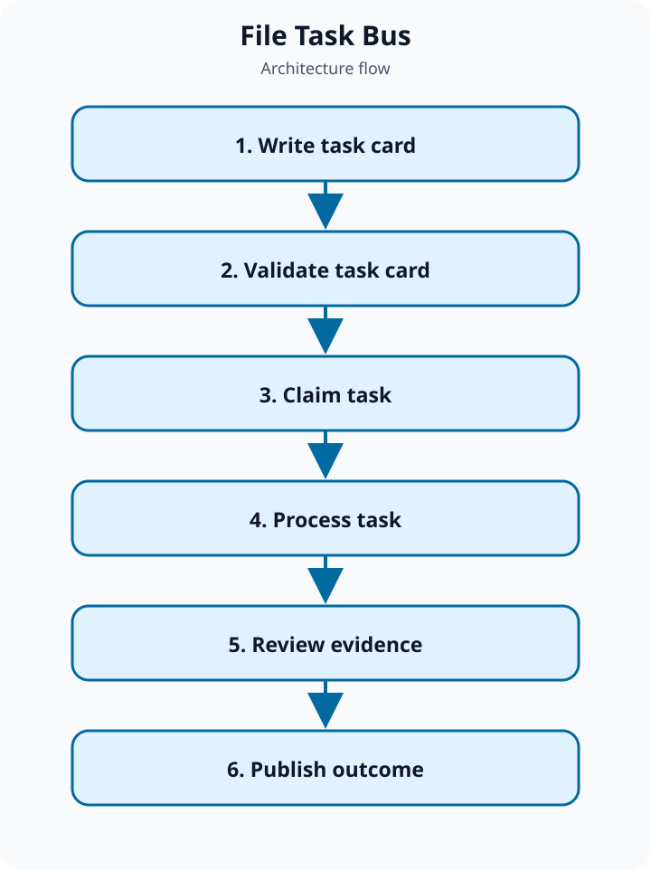

# File Task Bus

A transparent file-based task queue for agents and humans working across separate tools.

## Why this exists

Small teams need a durable bridge between agents without introducing a database or coupling every tool to the same API.

## What it provides

Use folders, task cards, watchers, and explicit lifecycle states to make work visible, portable, and easy to recover.

## Intended users

Solo builders and small teams coordinating local agents, scripts, and human review.

## Example

Drop a research task into inbox, let a worker process it, and review the evidence before it reaches outbox.

## Visual overview

[Open the architecture and sequence diagrams](docs/DIAGRAMS.md).

## Current status

Public scaffold. The repository defines the product contract and MVP boundaries before implementation begins.

## Documentation

- [Product definition](docs/PRODUCT.md)
- [Architecture](docs/ARCHITECTURE.md)
- [Flow and sequence diagrams](docs/DIAGRAMS.md)
- [Safety](docs/SAFETY.md)
- [Roadmap](docs/ROADMAP.md)

## License

MIT. See [LICENSE](LICENSE).
