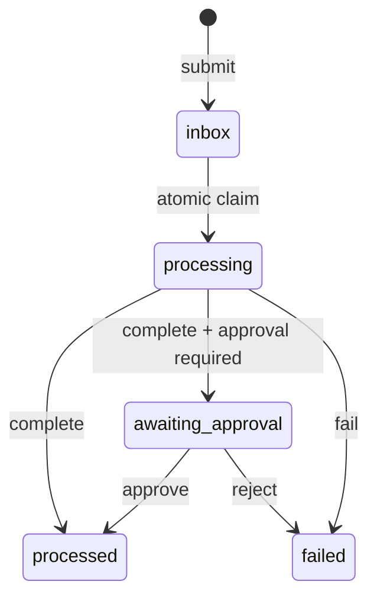

# File Task Bus


A transparent, filesystem-based task queue for AI agents, local tools, and human reviewers.

File Task Bus solves the awkward gap between “run everything in one framework” and “build a hosted queue.” Tasks are human-readable JSON files, lane changes are visible folder moves, and workers claim work with an atomic rename. There is no server, database, account, or provider lock-in.

## Who it is for

- Solo builders coordinating coding, research, or automation agents
- Small teams that want an inspectable local handoff layer
- Tool authors who need a protocol that any language can read

## Run it

Requires Python 3.11+ and has no runtime dependencies.

```bash
git clone https://github.com/mahsan07/file-task-bus.git
cd file-task-bus
python -m pip install -e .
file-task-bus --root .demo init
file-task-bus --root .demo submit "Summarize notes" --id task-1 --payload '{"source":"notes.md"}' --requires-approval
file-task-bus --root .demo claim --worker researcher
file-task-bus --root .demo complete task-1 --actor researcher --result '{"summary":"Decisions captured"}'
file-task-bus --root .demo approve task-1 --reviewer human
file-task-bus --root .demo digest
```

With [uv](https://docs.astral.sh/uv/), replace installation with `uv sync` and prefix commands with `uv run`.

On PowerShell, `examples/demo.ps1` runs the complete approval flow.

## Lifecycle



Each task records its payload, result, error, owner, timestamps, and event history. The folder is both transport and audit surface.

## Python API

```python
from file_task_bus import TaskBus

bus = TaskBus(".task-bus")
bus.submit("Index documents", {"glob": "docs/*.md"}, task_id="index-1")
task = bus.claim_next("indexer")
bus.complete(task["id"], {"documents": 7}, actor="indexer")
```

## What is different

General agent harnesses usually assume every worker runs inside their runtime. File Task Bus is deliberately smaller: the protocol is the filesystem, state is inspectable without an SDK, and agents written in different languages can coordinate without sharing credentials or a vendor API.

This MVP includes the task schema, atomic claim helper, five lifecycle lanes, approval and failure paths, change watcher, digest generator, CLI, and tests. It is a local coordination primitive—not a distributed transactional queue.

## Verify it

```bash
python -m unittest discover -s tests -v
```

See [architecture](docs/ARCHITECTURE.md), [portfolio ecosystem](docs/ECOSYSTEM.md), [product definition](docs/PRODUCT.md), [safety boundaries](docs/SAFETY.md), [roadmap](docs/ROADMAP.md), and [status](STATUS.md).

MIT licensed. Contributions are welcome through focused issues and pull requests.
