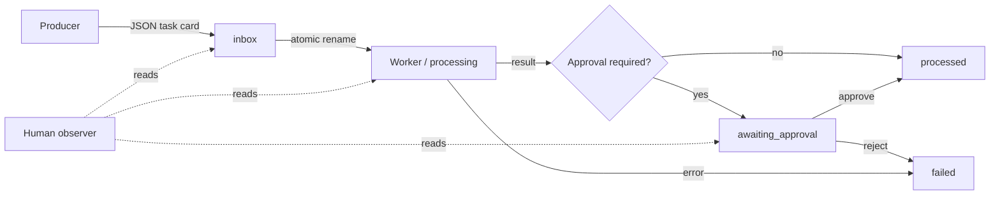

# Architecture

## Data flow



`TaskBus` owns lane creation, JSON serialization, transitions, digest generation, and watching. State is implied by the directory and repeated in the task card for portability.

## Reliability properties

- Workers claim an inbox card with a same-volume filesystem rename.
- JSON updates use a temporary sibling followed by `os.replace`.
- Invalid transitions fail visibly and preserve the current card.
- IDs are unique across all lanes.
- Events preserve who moved a task and when.

The implementation does not promise network-filesystem locking semantics or distributed exactly-once execution. Use it as a local coordination primitive and make worker operations idempotent.

## Package layout

```text
src/file_task_bus/
  bus.py       lifecycle and persistence
  cli.py       dependency-free CLI
tests/         success and failure fixtures
examples/      reproducible PowerShell demo
```
