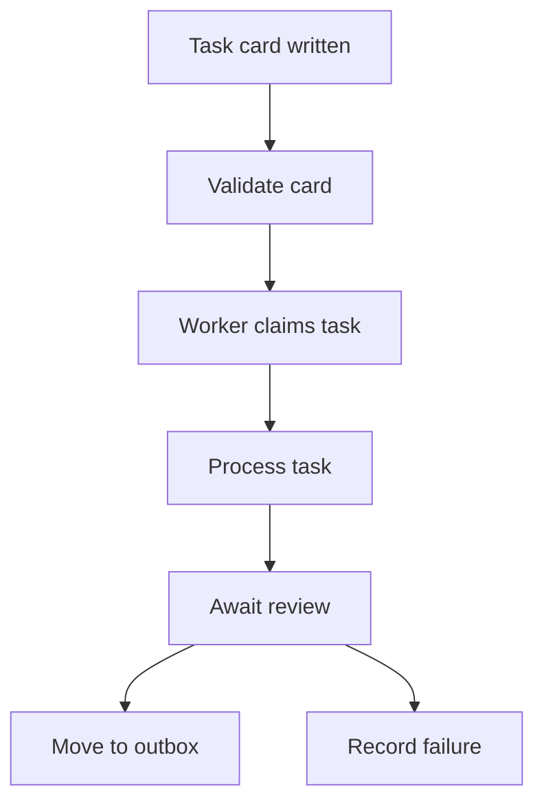
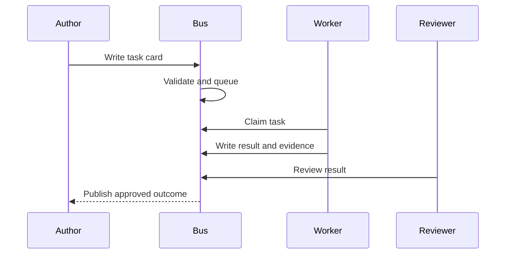

# File Task Bus diagrams

## Lifecycle flow

```mermaid
flowchart TD
  Submit["Task card written"] --> Validate["Validate card"]
  Validate --> Claim["Worker claims task"]
  Claim --> Process["Process task"]
  Process --> Review["Await review"]
  Review --> Done["Move to outbox"]
  Review --> Failed["Record failure"]
```

## Review sequence

```mermaid
sequenceDiagram
  participant A as Author
  participant B as Bus
  participant W as Worker
  participant R as Reviewer
  A->>B: Write task card
  B->>B: Validate and queue
  W->>B: Claim task
  W->>B: Write result and evidence
  R->>B: Review result
  B-->>A: Publish approved outcome
```
